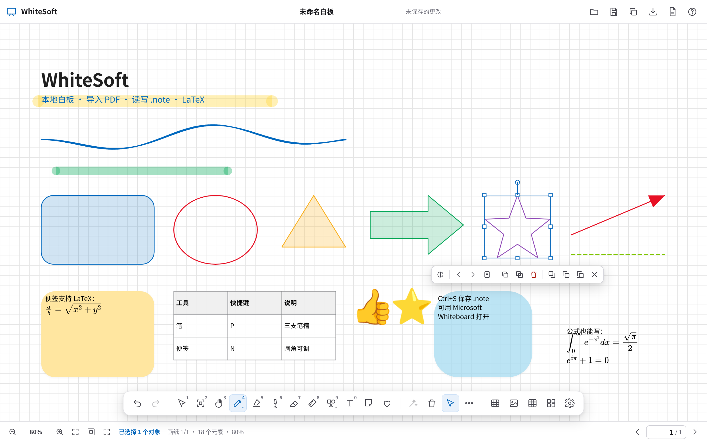

# WhiteSoft

**在浏览器里运行的本地白板 —— 导入 PDF，读写 Microsoft Whiteboard 的 `.note` 文件。**

WhiteSoft 是一个复刻 **Microsoft Whiteboard（Windows 本地版）** 的本地应用：界面是纯前端
Canvas 应用，由本机一个**零运行时依赖**的 Node 进程提供服务（静态资源 + `.note` 读写 API）。
所有数据都在你自己的磁盘上，全程离线。



- **导入 PDF** —— n 页的 PDF 变成 **n 张画纸**，每张画纸以对应的 PDF 页为背景，
  右下角的**页码输入框**可以直接跳到任意一页。
- **打开 / 保存 `.note`** —— 直接读取 Microsoft Whiteboard 本地版保存的 `.note` 压缩包，
  把每张画纸上的墨迹、荧光笔、直线、矩形、椭圆、箭头、折线、图片、文本以及 PDF 背景
  **按原始坐标忠实还原**；改完再存回 `.note`，得到的文件可以用 Microsoft Whiteboard 打开。
- **文本与便签支持 LaTeX** —— 在文本框或便签里写 `$x^2$` / `$$\int_0^1 x\,dx$$`，
  由内置的 **MathJax** 渲染成真正的数学排版（离线，无需联网）。
- **保存是非破坏性的** —— `.note` → `.note` 只重写 `manifest.json` 与 `Pages/*.json`，
  源归档里的每一个条目都原样搬运（连当前没有任何画纸引用的图片也保留），
  350 MB 的白板存回也只要一两秒；先写临时文件再原子重命名，中途失败不会破坏原文件。

> **English** — WhiteSoft is an offline, browser-based clone of the Microsoft Whiteboard
> Windows app, served by a zero-dependency Node process on `127.0.0.1`. It imports PDFs
> (one whiteboard page per PDF page) and reads/writes the local `.note` format with full
> fidelity: ink, highlighters, shapes, images, text, tables, sticky notes and the PDF
> backdrop, all in their original world coordinates. Text boxes and sticky notes render
> **LaTeX** (`$…$` / `$$…$$`) with a bundled MathJax. Saving is non-destructive — every
> entry of the source archive is carried over verbatim.
> Jump to [Quick start](#快速开始) · [`.note` format](#note-格式反向工程) · [Tests](#测试).

---

## 目录

- [快速开始](#快速开始)
- [功能](#功能)
- [键盘快捷键](#键盘快捷键)
- [`.note` 格式（反向工程）](#note-格式反向工程)
- [项目结构](#项目结构)
- [测试](#测试)
- [性能](#性能)
- [实现要点](#实现要点)
- [已知限制](#已知限制)
- [第三方组件与声明](#第三方组件与声明)

---

## 快速开始

### 环境要求

| 项目 | 要求 |
|---|---|
| **Node.js** | **18 或更高**。服务端只用 Node 内置模块，运行时**不需要 `npm install`** |
| **浏览器** | 桌面版 Chrome / Edge / Firefox（需要 Canvas 2D、`Path2D` 与 ES Module）|
| **系统** | Linux / macOS / Windows。启动脚本是 bash；Windows 上直接 `node server.mjs` 即可 |

### 启动

```bash
git clone https://github.com/cutx64/WhiteSoft.git
cd WhiteSoft
./whitesoft.sh
```

脚本会检查 Node 版本、确认端口可用、列出工作区里的白板，然后启动服务：

```
WhiteSoft — 本地白板
──────────────────────────────────────────────
界面地址 : http://127.0.0.1:8787/
工作区   : /path/to/workspace
发现白板 : lecture-01.note, lecture-02.note
停止服务 : Ctrl+C
──────────────────────────────────────────────
```

浏览器打开 **http://127.0.0.1:8787/** 即可（加 `--open` 会自动打开）。

**工作区**是存放 `.note` / `.pdf` 的目录：标题栏的「打开」对话框会列出其中的文件，
保存 `.note` 也以它为根。默认取**本仓库的上一级目录**，通常应该用 `--root` 指定到你自己
的白板目录：

```bash
./whitesoft.sh --root ~/my-boards
```

常用参数：

| 参数 | 说明 |
|---|---|
| `-p, --port <n>` | 监听端口，默认 `8787`（也可用环境变量 `PORT`）|
| `-H, --host <addr>` | 监听地址，默认 `127.0.0.1`（仅本机；改成 `0.0.0.0` 会暴露到局域网）|
| `-r, --root <dir>` | 工作区目录，默认本仓库的上一级目录 |
| `--open` | 启动后自动打开默认浏览器 |
| `--auto-port` | 端口被占用时自动顺延（最多试 50 个）|
| `-h, --help` | 显示帮助 |

也可以绕过脚本直接启动服务端：

```bash
node server.mjs --port 8787 --host 127.0.0.1 --root ~/my-boards
```

> 服务端零运行时依赖；PDF 渲染（pdf.js）与 ZIP 打包（fflate）都已放在 `public/vendor/`，
> 离线可用。

### 第一次使用

1. 点标题栏的 **导入 PDF**（或把 PDF 拖进窗口）→ 生成 n 张画纸，每页以 PDF 页为背景。
2. 用工具栏在画纸上批注；右下角 `‹ [页码] / n ›` 可以跳到任意画纸。
3. `Ctrl+S` 保存为 `.note`，得到的文件可以直接用 Microsoft Whiteboard 打开。

> 仓库里**不包含** `.note` 样例文件（它们是个人笔记）。想立刻看效果，导入一份自己的 PDF 即可。

---

## 功能

### 墨迹与笔

- **3 支可分别自定义的笔**（`Alt+1/2/3` 切换）：各有 15 色 + 彩虹/极光渐变笔、
  粗细 1–20 连续滑块、不透明度、无/单/双箭头。
- **荧光笔**：15 色、半透明、粗细 8–60，带**「直线绘制」开关** —— 开启后像直线工具一样
  拉出笔直的高亮。
- **激光笔**（不落墨、自动淡出）、**橡皮擦**（整笔擦除）、`Shift` 画直线/正方形/正圆。

### 高亮端点

凡是**直线**高亮（两点，或多点但完全共线）都画成「跑道形」——矩形高亮带 + 两端半圆。
这不只对新画的生效：**打开原版 `.note` 时，用直线绘制划的高亮也会以半圆端点渲染**。
自由手绘的弯曲高亮仍是平头。不想要这个效果，可以在 设置 里关掉
「高亮直线显示半圆端点」。

### 直尺

点工具栏的尺子图标或按 `R` 显示。直尺悬在画布之上，**任何工具下都能直接抓住**：
拖尺身移动、拖右端手柄旋转、悬停时滚滚轮微调角度；沿尺边画线（含荧光笔）自动吸附成直线，
`Shift` 可吸附到 15° 整数倍。

### 对象

形状（正方形 / 圆 / 三角形 / 五边形 / 六边形 / 五角星 / 块状箭头 / 平行四边形 / 菱形 /
圆角矩形，以及虚线 / 直线 / 单箭头 / 双箭头，可填充）、文本框、便签（12 色）、表格、
图片（插入 / 粘贴 / 缩放 / 旋转）、反应（8 个 emoji）。

### 便签样式

便签默认是**圆角**的，颜色、透明度、圆角大小都可以单独调整：

- **颜色**：12 色便签色板；换颜色只改色相，**不会把便签的透明度改回不透明**。
- **透明度**：10% – 100%。透明度写在便签颜色的 `#AARRGGBB` alpha 通道里，
  所以它会随 `.note` 一起保存，Microsoft Whiteboard 打开也认得。
- **圆角**：0% – 50%（占便签短边的比例），0% 是直角、50% 接近胶囊形；
  缩放便签时圆角按比例跟着变。
- 打开方式：工具栏的**便签**工具，或选中便签后点操作栏的**便签样式**按钮
  （选中多张便签时一次改全部）。面板里的设置同时会成为**新建便签**的默认样式。
- 便签的投影只画在便签**外侧一圈**，不会透过半透明的纸面把便签压暗。

### LaTeX 公式（MathJax）

文本框和便签里可以直接写 LaTeX，画布上渲染成真正的数学排版：

| 写法 | 效果 |
|---|---|
| `$x^2+y^2$` | 行内公式，与中英文混排 |
| `\(x^2\)` | 同上（TeX 写法）|
| `$$…$$` / `\[…\]` | 独立公式，自动独占一行 |
| `\$9.99` | 转义，按字面量显示 `$9.99` |

- 渲染交给**内置的 MathJax**（`public/vendor/mathjax/`，离线可用，不请求 CDN）。
- 公式会先排版成 SVG，再栅格化进渲染缓存：**平移、缩放、页面缩略图都不会重新排版**，
  位图按 2 的幂分档缓存；导出 PNG / PDF 时按导出分辨率重新栅格化。
- 编辑时由 DOM 编辑器**独占绘制**文字（输入 `$` 的瞬间就开始加载 MathJax），
  画布不再叠画一份，所以不会出现重影；关闭编辑器后立刻变回公式。
  便签编辑时保留纸面、表格编辑时保留网格，只有文字交给编辑器。
- 语法写错不会崩：MathJax 会画出红色的错误提示，原文始终保存在元素里。
- 普通文本里的 `$` 不会被误判：`价格 $5 与 $6` 仍是纯文本。

### 选择与编辑

套索选择、矩形框选、点选、`Shift` 加选、八向缩放手柄、旋转手柄、层序调整、锁定/解锁、
对象吸附对齐参考线、墨迹转形状（Beautify）、复制粘贴再制、方向键微移、`Alt+方向键` 旋转、
替代文本（Alt text）。

**框选手势（套索 / 矩形框选）**：按下就进入**虚线框选流程** —— 拖动过程中实时画出
**虚线矩形 / 虚线套索**并把区域淡淡着色，同时**忽略按下的那个对象**（不会顺手把它拖走、
也不会提前选中）；松手时才根据最终区域判定选中了哪些东西。

- 起点落在**已选中的对象**上时，这一次是「移动」（这样选中之后才拖得动）。
- 原地点一下（没有拖动）等同于点选：选中指针下的那个对象。
- 拖动手柄（缩放 / 旋转）不受影响，一按即生效。

**图片等比缩放**：图片（和反应）无论拖角手柄还是边手柄，都保持长宽比不变。

### 所选操作栏

选中任何对象后，选区**下方**浮出一条操作栏：编辑、便签样式、改变颜色、复制到上一页 / 下一页 /
指定页码、复制、再制、删除、置于顶层 / 底层 / 移到图层最底层。拖动时会自动隐藏，
不会挡住手势；误关之后可以点工具栏的「操作栏」按钮恢复。
操作栏会**按所选内容增减按钮**（只选文本框时没有便签样式，只选形状时两个都没有）。

- **编辑**：只框选/选中**一个文本框或一张便签**时出现，点一下直接进入文字编辑，
  不用再双击；编辑期间操作栏自动隐藏。
- **便签样式**：所选里只要有便签就出现，一次调整其中**所有**便签的圆角 / 颜色 / 不透明度；
  一次拖动只记**一步撤销**。
- **复制到任意页**：把选中的对象按原坐标复制到目标画纸，原页保留；可撤销。
- **改变颜色**：按所选内容自动切换色板（便签用便签色板、文本用文字色板、荧光笔用高亮色板，
  其余用笔的色板）；便签只换色相、保留自身透明度，图片和反应不可改色，会给出提示。
- **移到图层最底层**：解决图片盖住批注的问题。

### 删除

`Delete` / `Backspace` 删除全部选中对象（墨迹、形状、文本、便签、表格、图片、反应）；
工具栏垃圾桶按钮、`⋯ 更多` 菜单、**右键菜单**（剪切 / 复制 / 再制 / 置顶 / 置底 / 锁定 /
替代文本 / 删除）都能触发；删除可整体撤销并恢复原来的层序与选中状态。
空白处右键是另一套菜单（粘贴 / 全选 / 解锁全部 / 在此页之前·之后新建画纸 /
适应页面宽度 / 显示整页 / 清空当前画纸）。

### 视图与比例

无限画布、移动画布工具（手形，`G`）、空格 + 拖动、中键拖动、滚轮平移、
`Ctrl+滚轮` 以光标为中心缩放、双指缩放、适应宽度 / 显示整页、全屏（`F11`）、
背景（无 / 方格 / 横线 / 点阵 + 画布颜色）。

**比例是全局的**：整个白板只有**一个缩放比例**，在第一页从 80% 调到 100%，翻到第 50 页、
第 200 页也还是 100%；翻页只改变滚动位置（每页顶部对齐），不改变比例。
「适应宽度 / 显示整页」算出的比例同样会成为全白板的比例。

**底栏比例可直接输入**：在右下角的比例框里输入 `137`、`42.5%`、`250` 回车即跳到该比例，
留空回车回到 100%，非法输入不生效。**新建 / 打开白板的默认比例是 80%**，
可在 设置 →「新建 / 打开白板时的默认比例」改成 50% / 80% / 100% / 125% / 150%。

### 页面与文件

- **页面**：页面面板（实时缩略图、拖拽排序、复制、删除）、新建画纸、
  **右下角页码输入框跳转**、`PageUp/PageDown` 翻页。
- **文件**：导入 PDF（n 页 → n 张画纸，版式为一屏宽，即在 100% 时正好铺满窗口宽度）、
  打开 `.note`、保存 / 另存为 `.note`、导出 PNG / PDF / Zip(HTML+JSON)、
  拖放 `.note` 或 `.pdf` 到窗口打开。
- **未保存更改有确认框**：打开其他 `.note`、导入 PDF 或新建白板前会先弹出
  （取消 / 放弃更改 / 保存并继续）。
- **快捷键区分大小写**：小写字母是工具（`N` = 便签），大写字母是独立绑定
  （`Shift+N` = 新建白板），所以 `Shift+N` 不会误触发便签工具。
- **其他**：完整撤销重做（默认 300 步）、中文输入法友好的文本编辑、
  工具栏位置可切换（底部 / 顶部 / 左侧 / 右侧）。

---

## 键盘快捷键

按 `F1` 可以在应用内查看同一份列表。

| 按键 | 功能 |
|---|---|
| `Ctrl+Z` / `Ctrl+Y` | 撤销 / 重做 |
| `Ctrl+C` / `Ctrl+X` / `Ctrl+V` / `Ctrl+D` | 复制 / 剪切 / 粘贴 / 再制 |
| `Ctrl+A` / `Delete` | 全选当前画纸 / 删除所选 |
| 方向键 / `Shift+方向键` | 微移所选（无选中时平移画布）|
| `Alt+方向键` / `Alt+Shift+方向键` | 旋转所选 / 单向缩放所选 |
| `Ctrl+Shift+]` / `Ctrl+Shift+[` | 置于顶层 / 置于底层 |
| `Alt+B` | 墨迹转形状（Beautify）|
| `1` – `9` / `0` | 按工具栏顺序切换工具（1 套索、2 矩形框选、3 移动画布、4 笔、5 荧光笔、6 激光笔、7 橡皮、8 直尺、9 形状、0 文本）|
| `V` / `M` / `G` | 套索选择 / 矩形框选 / 移动画布 |
| `P` / `H` / `L` / `E` | 笔 / 荧光笔 / 激光笔 / 橡皮擦 |
| `Alt+1` `Alt+2` `Alt+3` | 切换三支笔 |
| `Alt+W` `Alt+Q` `Alt+X` `Alt+E` | 笔 / 套索选择 / 橡皮擦 / 反应 |
| `R` / `S` / `T` / `N` / `B` / `O` | 直尺 / 形状 / 文本 / 便签 / 表格 / 反应 |
| `Shift+N` | 新建白板 |
| `Shift+绘制` | 直线 / 正方形 / 正圆（约束）|
| `Ctrl+0` / `Ctrl+Shift+0` | 适应宽度 / 显示整页 |
| `Ctrl++` / `Ctrl+-` | 放大 / 缩小 |
| `Ctrl+滚轮` / `滚轮` / `Shift+滚轮` | 缩放 / 垂直平移 / 水平平移 |
| `空格+拖动` / 中键拖动 | 平移画布 |
| `PageUp` / `PageDown` | 上一页 / 下一页 |
| `Ctrl+Alt+N` / `Ctrl+Alt+P` | 在当前页之后 / 之前新建空白画纸 |
| `Ctrl+Shift+P` | 显示 / 隐藏页面面板 |
| `Ctrl+S` / `Ctrl+Shift+S` | 保存 `.note` / 另存为新 `.note` |
| `Ctrl+O` / `Ctrl+Shift+I` | 打开 `.note` / 导入 PDF |
| `Enter` / 双击 | 编辑所选（或指针下）的文本、便签、表格 |
| `Esc` / `F1` / `F11` | 取消当前操作 / 快捷键帮助 / 全屏 |

---

## `.note` 格式（反向工程）

这一节是阅读本仓库代码时最省时间的部分：`.note` 是 Microsoft Whiteboard Windows 本地版的
存储格式，没有公开文档，下面全部由样例文件反推、并用两个真实白板验证过。

`.note` 就是一个普通 ZIP：

```
manifest.json                     文档元信息 + 画纸顺序
Pages/page<N>.json                每张画纸一个文件
Resources/Images/<guid>.png       所有粘贴 / 插入的位图
Resources/Document/<name>.pdf     导入的 PDF 原件
```

### manifest.json

```json
{
  "id": "3f1c0b7a-9d24-4c6e-8a51-0f2b7c9e4d18",
  "version": "1.0.0",
  "screenWidthPixels": 2880,
  "screenHeightPixels": 1920,
  "screenScale": 2,
  "pages": [{ "fileName": "page1.json" }, "…"],
  "currentPage": 163,
  "backgroundColor": "#FFFFFFFF",
  "createTime": "2026-09-18 20:31:00",
  "document": { "fileName": "textbook.pdf" }
}
```

`currentPage` 是**从 1 开始**的；`document` 只在白板里嵌了 PDF 时出现。

### 画纸 `Pages/pageN.json`

```json
{
  "elements": [ "…" ],
  "scale": 0.8,
  "pdfPages": [{ "pageNumber": 10, "bounds": "143.998,83.1995,1152.0033,1636.0026" }]
}
```

- 所有 `bounds` 一律是 `"x,y,w,h"`、**世界坐标**（与元素坐标同一套）。
- `scale` 是导入 PDF 时的版式因子：**PDF 页的世界宽度 = 视口逻辑宽度 × scale**。
  视口逻辑宽度是 `screenWidthPixels / screenScale = 2880 / 2 = 1440`，
  于是 `1440 × 0.8 = 1152.0033` —— 与文件里的数值吻合；PDF 页水平居中
  （`x = (1440 − 1152) / 2 = 143.998`）。
- 白板本身没有固定页面尺寸：一张画纸就是一组世界坐标下的元素，`bounds` 由内容决定。

### 元素类型

| 数值 | 含义 | 字段 |
|---|---|---|
| `100001` | 手写墨迹 | `stroke` `width` `inks:[{x,y,pr}]`，`pr` 为压感 0–1 |
| `100005` | 荧光笔 | `stroke`（带透明度）`width` `closed:false` `points:[{point:"x,y"}]` |
| `200002` | 直线 | `points`（2 点，可带 `dash:true`）|
| `200003` | 矩形 | `points`（4 点，`closed:true`）|
| `200004` | 椭圆 | `points`（4 点 = 上/右/下/左，`closed:true`）|
| `200015` | 箭头 | `points`（4 点 = 起点/终点/箭头两角）|
| `200017` | 折线 | 任意点数，可带 `dash` |
| `300001` | 图片 | `bounds` `rotation` `fileName` |
| `300002` | 文本 | `bounds` `fontSize` `text` `textColor` |

颜色是 .NET 的 `#AARRGGBB`；荧光笔的 `5A` 前缀就是它 ~35% 的透明度。
`pr` 是压感：渲染时按 `width/2` 做变宽缎带，笔迹因此有自然的粗细变化。

### 本克隆新增的类型（Microsoft Whiteboard 不会产生，但格式兼容）

| 数值 | 含义 |
|---|---|
| `200005` / `200006` / `200007` / `200008` / `200009` / `200010` / `200011` | 三角形 / 菱形 / 五边形 / 六边形 / 五角星 / 平行四边形 / 块状箭头 |
| `200016` | 双箭头 |
| `400001` | 便签 |
| `400002` | 表格 |
| `400003` | 反应（emoji）|

另外 `locked` / `rounded` / `inkGradient` / `arrow` / `textAlign` / `underline` / `headerRow`
等是可选扩展字段：保存后依然是合法 JSON，读回时原样保留。
便签还多一个 `radius`（圆角占短边的比例）——便签的透明度则写在 `color` 的 `#AARRGGBB`
alpha 通道里，不额外占字段。

---

## 项目结构

```
whitesoft.sh                启动脚本（检查 Node 版本 / 端口 / 工作区，打印地址后 exec 服务端）
server.mjs                  零依赖 HTTP 服务：静态资源 + ZIP 随机读 + .note 保存 + PDF 上传
package.json                运行时无依赖，只有测试用的 puppeteer-core
public/
├── index.html
├── favicon.ico
├── css/app.css             Fluent 风格样式
├── js/
│   ├── main.js             应用入口：打开 / 保存 / 导入 PDF / 导出 / 快捷键 / 剪贴板
│   ├── ui.js               界面框架：标题栏、工具栏、页面面板、状态栏、浮出面板与对话框
│   ├── editor.js           编辑器状态：相机、画纸、选择、指针事件分发、页面增删
│   ├── tools.js            各种工具 + 形状构造 + 墨迹转形状
│   ├── render.js           Canvas 渲染器（世界坐标缓存 + 路径缓存）
│   ├── elements.js         元素模型 + 调色板 + 命中测试 + 几何变换
│   ├── mathtext.js         LaTeX：分隔符解析、MathJax 排版、位图缓存、富文本排版
│   ├── selectionbar.js     所选操作栏
│   ├── document.js         文档模型 + .note 读写 + PDF 导入排版
│   ├── pdfmanager.js       pdf.js 封装（分页位图缓存、CJK CMap）
│   ├── resources.js        图片资源缓存
│   ├── inlineeditor.js     文本 / 便签 / 表格的 DOM 内联编辑器（中文输入法友好）
│   ├── geometry.js         Rect / 句柄 / 命中几何 / 曲线简化
│   ├── history.js          撤销重做（默认 300 步）
│   └── util.js             杂项
└── vendor/
    ├── pdfjs/              pdf.js 4.10.38 + cmaps（中文 PDF 必需）+ standard_fonts
    ├── mathjax/            MathJax 3.2.2（TeX → SVG），文本框 / 便签的公式渲染
    └── fflate/             Zip 导出用的压缩库
test/                       端到端测试（Puppeteer 驱动真实 Chromium），见下一节
```

---

## 测试

测试用 [puppeteer-core](https://github.com/puppeteer/puppeteer) 驱动**真实 Chromium**，
对界面做端到端操作（真指针事件、真渲染、真保存），而不是单元测试。

### 准备

```bash
npm install                                   # 只为测试安装 puppeteer-core
npx @puppeteer/browsers install chrome@stable # 下载 Chrome for Testing 到 .browsers/
node server.mjs --port 8787 --root <白板目录>  # 测试默认连 http://127.0.0.1:8787/
```

Chrome 路径默认取 `.browsers/chrome/linux-153.0.8010.52/chrome-linux64/chrome`，
换机器时用 `--chrome /path/to/chrome` 指定即可。

### 运行

```bash
node test/e2e.mjs                 # 53 项：两个样例白板的加载与还原、重页面渲染、全部绘图工具、直尺约束、
                                  #        选择变换与撤销、墨迹转形状、页面导航、.note 保存回读、PDF 导入与另存、PNG/Zip 导出
node test/round2.mjs              # 32 项：打开对话框、表格单元格编辑、便签缩放手柄、复制粘贴与跨页粘贴、
                                  #        滚轮/空格/中键平移、直尺移动旋转微调、四种背景、Alt+… 快捷键、三支笔槽、替代文本
node test/round3.mjs              # 46 项：撤销/删除后立即重绘（画布指纹验证）、手形工具、荧光笔直线开关、
                                  #        半圆端点逐像素验证、批量删除、右键菜单、任意比例输入、未保存更改确认框
node test/round4.mjs              # 28 项：第一次框选只选择不移动、数字键 1–0、Shift+N 新建白板、
                                  #        Ctrl+Alt+N/P 前后插入画纸、所选操作栏、图片等比缩放、移到图层最底层
node test/strokes.mjs             # 9 项：笔迹连续性 —— 沿每条墨迹中线逐像素采样，要求 100% 命中
node test/sticky.mjs              # 22 项：便签圆角 / 颜色 / 透明度、操作栏按所选内容增减按钮、
                                  #        「编辑」按钮直接进入编辑、一步撤销、像素级外观验证
node test/math.mjs                # 34 项：LaTeX —— 分隔符解析、MathJax 排版与栅格化、公式驱动排版、
                                  #        独立公式独占行、坏公式、缓存与重绘、导出含公式、
                                  #        编辑态不重影（文本框 / 便签 / 表格）、以及"选工具→点击→打字→提交"的真实交互
node test/perf.mjs                # 帧率基准（可加 --dpr 2 / --index <页码>）
node test/smoke.mjs               # 冒烟测试 + 截图（--note <文件> --page <n> --headed）
node test/visual.mjs              # 单页视觉比对（同时用 pdftoppm 输出参考图）：--note --index --zoom
node test/thumbs.mjs              # 页面缩略图（懒加载）
node test/inline.mjs              # 内联编辑器（文本 / 便签 / 表格）
node test/final.mjs               # 脏标记：干净加载不显示、编辑后显示
```

`e2e` / `round2` / `round3` / `round4` / `strokes` / `math` / `sticky` 结束时打印
`===== N/N 通过 =====`，有失败项时以非零码退出。

> **注意**：`e2e.mjs`、`round2.mjs`、`round3.mjs` 里有针对两个私有样例白板的硬编码断言
> （446 页 / 655 页、第 265 页 1751 个元素、第 168 页的 14 条直尺高亮等），
> 仓库里**不含**这两个文件。要复现请把它们放到工作区根目录（或按自己的白板改断言）；
> `math.mjs` / `sticky.mjs` / `strokes.mjs` / `smoke.mjs` / `visual.mjs` 自带内容或支持
> `--note <你的文件>`，不需要样例白板。

本仓库最近一次全量运行（Linux、无头 Chromium 153、软件渲染）：

| 套件 | 结果 |
|---|---|
| `test/e2e.mjs` | **53 / 53 通过** |
| `test/round2.mjs` | **32 / 32 通过** |
| `test/round3.mjs` | **46 / 46 通过** |
| `test/round4.mjs` | **28 / 28 通过** |
| `test/strokes.mjs` | **9 / 9 通过** |
| `test/math.mjs` | **34 / 34 通过** |
| `test/sticky.mjs` | **22 / 22 通过** |

---

## 性能

渲染器做过一轮针对性优化：每页元素都先画进一张**世界坐标缓存**位图，每帧只把可见的那一小块
贴到屏幕上；重页面（1751 个元素 / 18.6 万个点）因此也能跑满帧。

| 优化 | 说明 |
|---|---|
| **世界坐标缓存 + 切片 blit** | 每帧只把缓存里**可见的那一小块**贴到画布上，绘制开销与视口大小成正比，与缓存留了多少余量无关 |
| **缓存分辨率按 2 的幂吸附** | 连续缩放只在跨越一个八度时才重建，不再每个滚轮事件重建一次 |
| **手势期间延迟重建** | 拖动 / 缩放过程中先复用旧光栅（只是被缩放），松手后再重建，手感不掉帧 |
| **PDF 合成进缓存** | 每帧重新缩放合成整页 PDF 位图约 15 ms，现在只在重建缓存时做一次 |
| **Path2D 几何缓存** | 笔迹 / 荧光笔 / 形状的路径按元素缓存（`WeakMap`），重建时直接复用，不再重算 18.6 万个点 |
| **不按帧强制排版** | 画布位置改为缓存，不再每个 `pointermove` 都 `getBoundingClientRect()` |
| **图片加载合并失效** | 同一帧到货的多张图片只触发一次重建，且手势期间延后 |
| **PDF 位图按整八度分档** | 重新栅格化 PDF 很贵，现在只有缩放跨一倍时才重做 |

实测（`node test/perf.mjs`，1600×1000，`devicePixelRatio = 1`，无头 Chromium 软件渲染）：

| 场景 | 轻页面（空画纸）| 重页面（1751 个元素 / 18.6 万点）|
|---|---|---|
| 画笔实时渲染 | 60.0 fps（draw 平均 0.7 ms）| 59.0 fps（draw 平均 0.2 ms）|
| 矩形框选 | 59.3 fps | 57.2 fps |
| 平移画布 | 60.0 fps | 60.0 fps |
| 缩放画布 | 60.0 fps | 54.9 fps |

每帧绘制耗时平均 **0.1 – 1.5 ms**（轻页面）与 **0.2 – 7.6 ms**（重页面）；
重建缓存的那一帧明显更重（缩放时最差约 150 ms），这也正是缓存按 2 的幂吸附、
并在手势期间延后重建的原因。把 `devicePixelRatio` 提到 2（像素量翻两番）后，
无头浏览器的每帧绘制耗时升到 **30 – 38 ms**、帧率 **26 – 50 fps** ——
无头环境是纯软件合成，这一档开销主要来自合成与贴图，真实浏览器有 GPU 合成，手感会好得多。

---

## 实现要点

- **零运行时依赖**：服务端只用 `node:http` / `node:fs` / `node:zlib`。
  ZIP 的读与写都是自己实现的（`server.mjs`）：读用中央目录 + 随机访问，
  写用**流式**写入并支持 `copyFrom` —— 直接把源归档里已压缩的条目原样搬运，
  所以保存 350 MB 的白板不需要解压再压缩任何一张图片。
- **保存是保真的**：`keepAll` 会保留源归档的每一个条目；新保存的文件先写成
  `*.tmp-<pid>` 再 `rename` 覆盖，中途失败不会破坏原文件。
- **归档句柄有缓存**：同一路径的 `.note` 只解析一次中央目录，并用 `size + mtime` 校验，
  覆盖保存后不会读到旧内容。
- **渲染与模型分离**：`elements.js` 只描述数据与几何，`render.js` 负责把世界坐标画出来，
  `editor.js` 管状态与指针事件，`ui.js` 管 DOM —— 所以测试可以既走真实指针事件，
  也可以直接操作模型来构造极端场景。
- **公式是"图片"，不是 DOM**：`mathtext.js` 用 MathJax 同步排版出 SVG，再栅格化成位图交给
  渲染器，因此公式和墨迹、图片走同一条缓存路径，MathJax 只在第一次出现 `$…$` 时才加载，
  没写公式的白板完全不会付出这份开销。
- **变宽缎带与端点半圆必须分成两个路径填充**：圆弧永远顺时针，合并进同一个 `Path2D`
  会与缎带的反向环绕相消，在笔迹上打出空洞 —— `test/strokes.mjs` 就是为这条规则写的回归测试。

---

## 已知限制

- **只支持 `.note` 这种本地格式**。云端 `.whiteboard` 是 OneDrive 的存储形式，不是同一种
  文件；本应用只是把它当普通 ZIP 尝试打开，未做验证。
- **保存会覆盖当前打开的 `.note`**（也就是 `doc.path` 指向的文件）。想保留原件请用
  「另存为」（`Ctrl+Shift+S`），或先把文件复制一份。
- 从零新建（导入 PDF 后另存）的白板会把 PDF 内嵌进 `.note`，文件大小 ≈ PDF 大小。
- 撤销历史按操作增量记录，上限 **300 步**。
- 页面缩略图是按需渲染的；快速滚动 400+ 页时缩略图会逐个补齐。
- 这是单人本地应用：**没有协作、评论、模板、Bing 图片搜索**等联网功能
  （原版这些能力依赖 Microsoft 账号与云服务）。
- 荧光笔的半圆端点来自本克隆的渲染规则（直线高亮一律圆头），新画的高亮会写一个
  `cap: "round"` 标记；原版文件没有这个字段，Microsoft Whiteboard 打开时忽略它、
  按平头显示，其余部分不受影响。
- **LaTeX 是本克隆的扩展**：公式以 `$…$` 源码存在元素的 `text` 字段里，
  Microsoft Whiteboard 打开时会原样显示成 LaTeX 源码（不会渲染成公式），
  在本应用里则始终渲染为公式。表格单元格目前不支持公式，只有文本框和便签支持。
- **缩放比例不写进 `.note`**：它只在本次会话内全局生效，重新打开白板会回到默认 80%。
  文件里的 `page.scale` 保留原版语义（版式因子 = 页面世界宽度 / 1440）。

---

## 第三方组件与声明

- [pdf.js](https://github.com/mozilla/pdf.js) 4.10.38（Apache-2.0，Mozilla Foundation）——
  `public/vendor/pdfjs/`，含 CJK `cmaps` 与 `standard_fonts`，用于把 PDF 页渲染成位图。
- [MathJax](https://github.com/mathjax/MathJax) 3.2.2（Apache-2.0，MathJax Consortium）——
  `public/vendor/mathjax/`（`tex-svg` 组件 + LICENSE），把文本框 / 便签里的 TeX 排版成 SVG。
- [fflate](https://github.com/101arrowz/fflate)（MIT）—— `public/vendor/fflate/`，
  导出 `Zip(HTML + JSON)` 时在浏览器里打包。

本项目是个人学习/自用性质的**非官方**实现，与 Microsoft 无关；
Microsoft、Microsoft Whiteboard 是 Microsoft Corporation 的商标。
